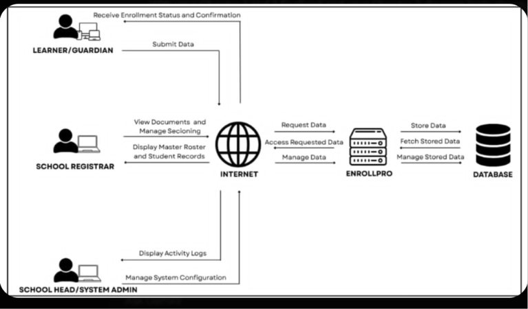

### 📐 Part 1: How to draw the Operational Framework Diagram

Set up your draw.io canvas with four distinct columns, just like the reference image.

**Column 1: The Actors (Far Left)**

* Draw an icon for **TEACHER** (Top Left).
* Draw an icon for **STUDENT** (Bottom Left).

**Column 2: The Network (Middle Left)**

* Draw a globe or cloud icon labeled **INTERNET**.

**Column 3: The System Engine (Middle Right)**

* Draw a server rack icon labeled **A.I.M.S. SERVER & AI ENGINE**.

**Column 4: The Storage (Far Right)**

* Draw a cylinder icon labeled **DATABASE**.

**The Arrow Labels (Data Flows):**

* **From TEACHER to INTERNET:**
* `Upload Materials & Configure Mastery Locks`
* `Approve AI Quizzes & Subjective Grades`

* **From INTERNET to TEACHER:**
* `Display AI Drafts & Student Analytics`

* **From STUDENT to INTERNET:**
* `Access Materials & Submit Tasks`
* `Submit Quiz & Remedial Answers`

* **From INTERNET to STUDENT:**
* `Display Final Grades & Lock Status`

* **Between INTERNET and A.I.M.S. SERVER (Double-sided arrows):**
* `Route User Requests & API Calls`
* `Execute Auto-Grading & Remediation Logic`

* **Between A.I.M.S. SERVER and DATABASE (Double-sided arrows):**
* `Store User & Quiz Data`
* `Fetch Content & Mastery Records`

---

### 📝 Part 2: Copy-Paste Ready Text for Chapter 3

---

**Operational Framework**

The operational framework of the Automated Intervention and Mastery System (A.I.M.S.) illustrates the structured flow of data, system interactions, and logical processes from the end-users to the backend database. The framework is designed using a four-tier architecture consisting of the User Layer, Network Layer, Application Layer, and Database Layer.

**1. User Layer (Actors)**
The system accommodates two primary users with distinct access levels and responsibilities:

* **Teacher:** Acts as the system facilitator. The teacher uses the interface to upload learning materials, input prompts for the AI-powered quiz generator, and configure mastery-lock passing thresholds. Crucially, the teacher serves as the "Human-in-the-Loop," receiving system-generated AI quiz drafts and subjective student responses for manual validation and approval before they are deployed to the learners.
* **Student:** Acts as the primary consumer of the platform. Students interact with the system by accessing distributed learning modules, submitting offline tasks, and answering active assessments. Based on their performance, they receive immediate feedback, final grades, and targeted remedial quizzes if mastery thresholds are not met.

**2. Network Layer (Internet)**
As a web-based educational platform, all communications between the user devices and the system engine are routed through the internet. This layer ensures that HTTP/HTTPS requests—such as a student submitting a quiz or a teacher approving a remediation lock override—are securely transmitted to the server in real-time.

**3. Application Layer (A.I.M.S. Server & AI Engine)**
This is the core processing hub of the system. Upon receiving requests from the network layer, the A.I.M.S. backend executes the primary business logic defined in the system's objectives. It handles the automated assessment and grading engine, instantly checking objective answers against stored keys. When a teacher requests a quiz or a student triggers a remediation protocol, this layer interfaces securely with Large Language Models (e.g., Google Gemini API) to generate targeted educational content. Furthermore, it enforces the mastery-based progression rules, autonomously restricting or granting access to subsequent modules based on real-time calculated scores.

**4. Database Layer**
The rightmost tier represents the central repository of the system. The database securely stores all persistent data, including user credentials, uploaded course materials, generated quiz banks, student task submissions, and academic gradebooks. The Application Layer continuously queries this database to fetch active assessments and updates it whenever a student alters their mastery status or a teacher publishes a newly approved AI assessment.