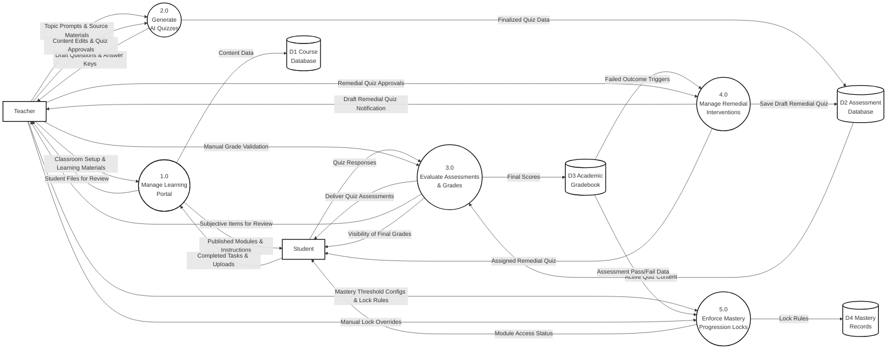

```mermaid
flowchart LR
    %% Styles replacing standard shapes with DFD typical ones
    classDef entity fill:#ffffff,stroke:#000000,stroke-width:2px,shape:rect;
    classDef process fill:#ffffff,stroke:#000000,stroke-width:2px,shape:circle;
    classDef datastore fill:#ffffff,stroke:#000000,stroke-width:2px,shape:cylinder;

    %% External Entities
    teacher[Teacher]
    student[Student]

    %% Processes (1.0 to 5.0)
    p1((1.0<br>Manage Learning<br>Portal))
    p2((2.0<br>Generate<br>AI Quizzes))
    p3((3.0<br>Evaluate Assessments<br>& Grades))
    p4((4.0<br>Manage Remedial<br>Interventions))
    p5((5.0<br>Enforce Mastery<br>Progression Locks))

    %% Data Stores
    d1[(D1 Course<br>Database)]
    d2[(D2 Assessment<br>Database)]
    d3[(D3 Academic<br>Gradebook)]
    d4[(D4 Mastery<br>Records)]

    %% Apply Classes
    class teacher,student entity;
    class p1,p2,p3,p4,p5 process;
    class d1,d2,d3,d4 datastore;

    %% Flows for 1.0
    teacher -->|Classroom Setup & Learning Materials| p1
    p1 -->|Content Data| d1
    p1 -->|Published Modules & Instructions| student
    student -->|Completed Tasks & Uploads| p1
    p1 -->|Student Files for Review| teacher

    %% Flows for 2.0
    teacher -->|Topic Prompts & Source Materials| p2
    p2 -->|Draft Questions & Answer Keys| teacher
    teacher -->|Content Edits & Quiz Approvals| p2
    p2 -->|Finalized Quiz Data| d2

    %% Flows for 3.0
    d2 -->|Active Quiz Content| p3
    p3 -->|Deliver Quiz Assessments| student
    student -->|Quiz Responses| p3
    p3 -->|Subjective Items for Review| teacher
    teacher -->|Manual Grade Validation| p3
    p3 -->|Final Scores| d3
    p3 -->|Visibility of Final Grades| student

    %% Flows for 4.0
    d3 -->|Failed Outcome Triggers| p4
    p4 -->|Save Draft Remedial Quiz| d2
    p4 -->|Draft Remedial Quiz Notification| teacher
    teacher -->|Remedial Quiz Approvals| p4
    p4 -->|Assigned Remedial Quiz| student

    %% Flows for 5.0
    teacher -->|Mastery Threshold Configs & Lock Rules| p5
    p5 -->|Lock Rules| d4
    d3 -->|Assessment Pass/Fail Data| p5
    p5 -->|Module Access Status| student
    teacher -->|Manual Lock Overrides| p5
```