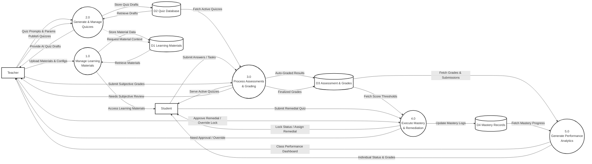

```mermaid
flowchart LR
    %% Styles replacing standard shapes with DFD typical ones
    classDef entity fill:#ffffff,stroke:#000000,stroke-width:2px,shape:rect;
    classDef process fill:#ffffff,stroke:#000000,stroke-width:2px,shape:circle;
    classDef datastore fill:#ffffff,stroke:#000000,stroke-width:2px,shape:cylinder;

    %% External Entities
    teacher[Teacher]
    student[Student]

    %% Processes (1.0 to 5.0 referencing the 5 Modules)
    p1((1.0<br>Manage Learning<br>Materials))
    p2((2.0<br>Generate & Manage<br>Quizzes))
    p3((3.0<br>Process Assessments<br>& Grading))
    p4((4.0<br>Execute Mastery<br>& Remediation))
    p5((5.0<br>Generate Performance<br>Analytics))

    %% Data Stores
    d1[(D1 Learning Materials)]
    d2[(D2 Quiz Database)]
    d3[(D3 Assessment & Grades)]
    d4[(D4 Mastery Records)]

    %% Apply Classes
    class teacher,student entity;
    class p1,p2,p3,p4,p5 process;
    class d1,d2,d3,d4 datastore;

    %% Flows for 1.0 Manage Learning Materials
    teacher -->|Upload Materials & Configs| p1
    p1 -->|Store Material Data| d1
    d1 -->|Retrieve Materials| p1
    p1 -->|Access Learning Materials| student

    %% Flows for 2.0 Generate & Manage Quizzes
    teacher -->|Quiz Prompts & Params| p2
    p2 -.->|Request Material Context| d1
    p2 -->|Store Quiz Drafts| d2
    d2 -->|Retrieve Drafts| p2
    p2 -->|Provide AI Quiz Drafts| teacher
    teacher -->|Publish Quizzes| p2

    %% Flows for 3.0 Process Assessments & Grading
    d2 -->|Fetch Active Quizzes| p3
    p3 -->|Serve Active Quizzes| student
    student -->|Submit Answers / Tasks| p3
    p3 -->|Auto-Graded Results| d3
    p3 -->|Needs Subjective Review| teacher
    teacher -->|Submit Subjective Grades| p3
    p3 -->|Finalized Grades| d3

    %% Flows for 4.0 Execute Mastery & Remediation
    d3 -->|Fetch Score Thresholds| p4
    p4 -->|Lock Status / Assign Remedial| student
    student -->|Submit Remedial Quiz| p4
    p4 -->|Need Approval / Override| teacher
    teacher -->|Approve Remedial / Override Lock| p4
    p4 -->|Update Mastery Logs| d4

    %% Flows for 5.0 Generate Performance Analytics
    d3 -->|Fetch Grades & Submissions| p5
    d4 -->|Fetch Mastery Progress| p5
    p5 -->|Class Performance Dashboard| teacher
    p5 -->|Individual Status & Grades| student
```