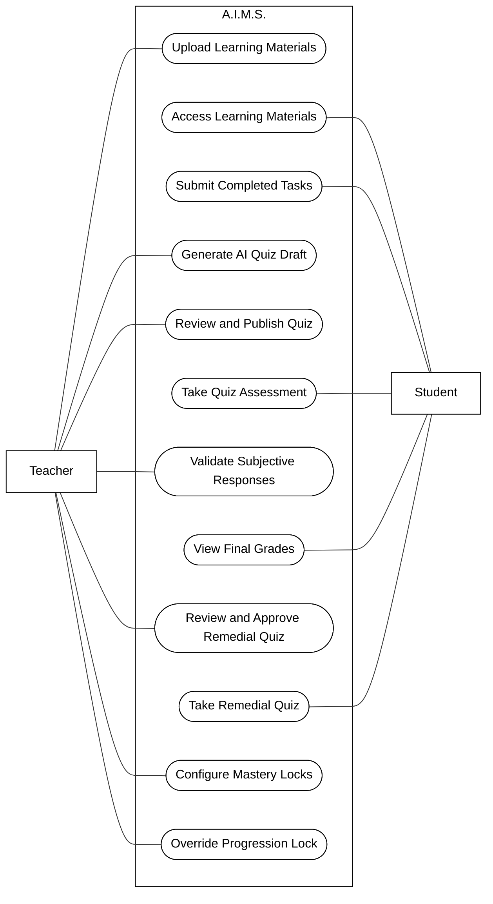

# A.I.M.S. Use Case Diagram

This use case diagram is derived from the current A.I.M.S. paper revision and the defined system behavior in Chapter 1 and Chapter 2.

This version follows the sample format more closely:

- Actors are placed outside the system boundary.
- Use cases are grouped inside a single A.I.M.S. system box.
- The use cases are written at a higher level so the diagram stays readable in a thesis document.
- Only the two primary actors from the paper, Teacher and Student, are shown.
- The process labels are kept generic and major-process oriented rather than feature-by-feature.